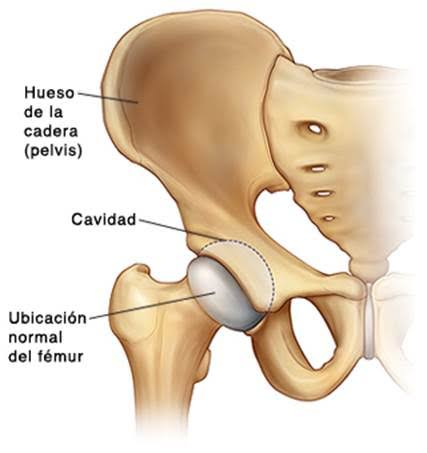

+++
title = "cadera"
date = 2020-01-19T15:41:01-06:00
lastmod = 2020-01-19T15:41:01-06:00
tags = ["2020", "condition", "spanish"]
categories = ["personal"]
imgs = ["cadera.jpg"]
readingTime = false  # show reading time after article date
toc = false
comments = true
justify = true  # text-align: justify;
single = false  # display as a single page, hide navigation on bottom, like as about page.
license = ""  # CC License
draft = false
+++

Los que me conocen en persona saben que mi caminar no es parejo, desde que tengo memoria he usado zapatos ortopédicos y/o plantillas especiales para aminorar el desnivel que tengo en mi pierna derecha para permitirme llevar una vida normal y sin necesidad de asistencia.

El diagnostico de mi condición es: **"displasia congénita de cadera derecha"**, en mi infancia temprana pase varios años de doctor en doctor y de hospital en hospital, e incluso estuve a punto que me intervinieran quirúrgicamente, pero se tomo la decisión de no hacerlo, y que ya adulto yo evaluaría si me la haría o no. Se que mis padres hicieron todo lo posible y tomaron las mejores decisiones basados en la información que tenían en ese momento y les agradezco mucho por ello. Ahora me toca a mi aceptar y tratar con el elefante blanco que me ha acompañado toda mi vida.

Escribir acerca de esto es terapéutico. Casi toda mi vida he evitado el tema -aunque nunca se puede evitar la pregunta de "¿que te paso en el pie?" con personas que recientemente conoces o personas que no lo notan la primera vez- y me las he arreglado para llegar a la edad de 42 años sin la necesidad de un bastón o cosas por el estilo he incluso haciendo deporte -en la medida de lo posible-.

Hace un par de años hice un dibujo de la representación de una cadera sana y mi cadera que justamente había visto en la radiografiá que me tomaron esa vez.

Recientemente me he puesto a leer y aprender mas acerca de la cadera, escribo aquí las ligas que me han parecido interesantes y relevantes para que no se me olvide, es probable que estaré actualizando y ampliando esta entrada en el futuro.



* [Displasia de cadera](https://www.mayoclinic.org/es-es/diseases-conditions/hip-dysplasia/symptoms-causes/syc-20350209)
* [La displasia de cadera leve tal vez no se detecte durante la infancia ni la adolescencia](https://newsnetwork.mayoclinic.org/discussion/la-displasia-de-cadera-leve-tal-vez-no-se-detecte-durante-la-infancia-ni-la-adolescencia/)
* [Síntomas de bursitis de Cadera, tratamiento y ejercicios](https://www.tuasaude.com/es/bursitis-de-cadera/)
* [¿Qué es la cadera y cuándo necesito una prótesis de cadera?](https://www.mba.eu/blog/que-es-protesis-de-cadera/)
* [Prótesis de cadera antes de cumplir los 40: los motivos de la nueva 'epidemia' mundial](https://www.elespanol.com/ciencia/salud/20190324/protesis-cadera-cumplir-motivos-nueva-epidemia-mundial/383712054_0.html)
